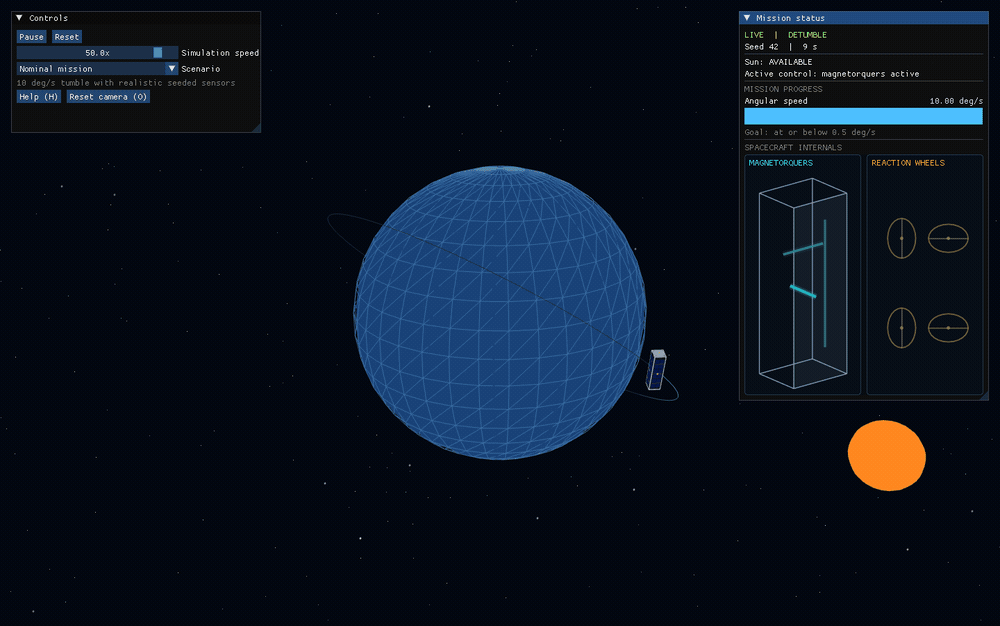
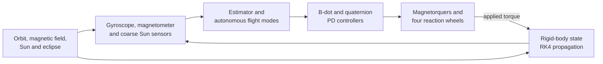
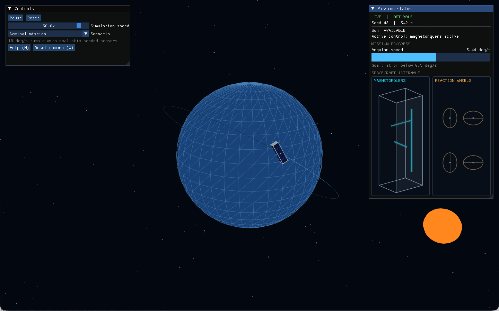

# Detumble

[](https://github.com/Cp557/detumble/actions/workflows/ci.yml)
[](LICENSE)
[](https://en.cppreference.com/w/cpp/20)

Detumble is a cross-platform C++ simulation of a 3U CubeSat autonomously recovering from an uncontrolled tumble in Low Earth Orbit. It models the spacecraft's rotational physics, sensors, actuators, attitude estimation, flight modes, and closed-loop control, then presents the mission in a focused desktop visualization.



[Download the higher-quality MP4 demo](docs/media/detumble-demo.mp4).

## Mission

The spacecraft begins in a 500 km circular orbit with a randomized attitude and three-axis tumble. Its onboard-style flight software then:

1. samples a gyroscope and Earth's magnetic field;
2. uses B-dot control and three magnetorquers to reduce the tumble;
3. waits safely when the Sun is hidden by Earth;
4. estimates attitude using TRIAD with gyroscope propagation;
5. acquires the Sun with a four-wheel pyramid; and
6. holds two body-mounted solar arrays toward the Sun.



Truth attitude is private to the simulation plant. The estimator and controllers receive only timestamped simulated measurements and inertial reference vectors.

## What Is Modeled

- Coupled three-axis rigid-body rotation with quaternion attitude
- Fixed-step fourth-order Runge–Kutta integration
- A simplified 500 km, 51.6-degree circular orbit
- Tilted-dipole Earth magnetic field and cylindrical eclipse geometry
- Seeded sensor bias, Gaussian noise, quantization, saturation, sample rates, and field of view
- Magnetometer sampling with magnetorquer coil blanking
- Saturated B-dot magnetic detumbling
- TRIAD attitude determination with gyroscope propagation and correction
- Quaternion PD Sun-pointing control
- Four reaction wheels in a redundant pyramid with torque, speed, and failure limits
- Autonomous `BOOT`, `DETUMBLE`, `SAFE`, `SUN_ACQUIRE`, and `SUN_POINT` modes
- Headless CSV runs and randomized Monte Carlo validation

## Control System

The attitude plant follows Euler's rigid-body equation:

$$I\dot{\omega} + \omega \times (I\omega) = \tau$$

During detumbling, the magnetic controller commands a dipole opposite the measured field change:

$$m = -k\,\frac{dB_{body}}{dt}, \qquad \tau_{mag} = m \times B$$

After detumbling, a quaternion PD controller requests reaction-wheel torque:

$$\tau_{body} = K_p e_q - K_d\omega$$

`SUN_ACQUIRE` deliberately uses a lower torque limit so the slew is gentle. `SUN_POINT` restores normal control authority for accurate tracking. Accelerating each internal wheel produces equal and opposite torque on the spacecraft body.

## Desktop Viewer

The raylib and Dear ImGui viewer shows the simulated Earth, orbit, Sun, spacecraft attitude, current flight mode, mission goal, and animated actuator internals. The spacecraft is a project-authored 3U GLB generated reproducibly with Blender; component locations remain configuration-driven in C++.



The viewer uses the same simulation core as the headless tools. Rendering rate and playback speed never change the fixed physical timestep or the sequence of simulated states.

## Validation

The project currently has 103 automated unit and integration tests. They cover frame conventions, quaternion math, dynamics conservation, environment geometry, sensor scheduling and errors, control laws, attitude estimation, actuator allocation, autonomous transitions, deterministic replay, and end-to-end missions.

The documented 25-case Monte Carlo campaign randomizes initial attitude, tumble axis, angular speed from 5 to 15 deg/s, orbit position, and realistic sensor errors.

| Result | Value |
| --- | ---: |
| Successful missions | 25 / 25 |
| Mean detumble time | 4,055 s |
| Mean sunlit RMS pointing error | 0.922 deg |
| Worst per-run RMS pointing error | 1.555 deg |
| Maximum final angular speed | 0.0314 deg/s |
| Maximum wheel speed | 1,557 rpm / 6,000 rpm |

For the default seed-42 mission, the spacecraft safely waits through eclipse, takes about 214 simulated seconds to slew toward the Sun, and finishes with 0.385 degrees of estimated pointing error.

## Build and Run

Requirements:

- C++20 compiler
- CMake 3.25 or newer
- Ninja
- Internet access during the first CMake configuration

On Debian or Ubuntu, first install raylib's desktop prerequisites:

```bash
sudo apt-get install libasound2-dev libgl1-mesa-dev libx11-dev \
  libxcursor-dev libxi-dev libxinerama-dev libxrandr-dev
```

Configure, build, and test:

```bash
cmake --preset debug
cmake --build --preset debug
ctest --preset debug
```

Launch the viewer:

```bash
./build/debug/detumble_viewer
```

Run the same mission headlessly and export full-rate telemetry:

```bash
./build/debug/detumble --duration 6000 --time-step 0.01 \
  --seed 42 --initial-rate-deg-s 10 \
  --sensor-profile realistic --output runs/detumble.csv
```

Use `--sensor-profile ideal` for a zero-error mathematical baseline.

## Monte Carlo Campaign

Build the optimized targets and run the documented validation envelope:

```bash
cmake --preset release
cmake --build --preset release

./build/release/detumble_monte_carlo --runs 25 --duration 8000 \
  --time-step 0.02 --seed 2026 \
  --results runs/phase13_runs.csv \
  --aggregate runs/phase13_aggregate.csv
```

The runner writes compact per-run and aggregate CSV metrics. Optional reduced telemetry can be enabled for investigating individual cases.

## Project Structure

- `detumble_core` — rendering-independent simulation library
- `detumble` — deterministic headless mission runner
- `detumble_monte_carlo` — randomized robustness campaign
- `detumble_viewer` — desktop mission visualization
- `detumble_tests` — unit and integration test executable
- `assets/scripts/create_detumble_3u.py` — reproducible Blender model generator

The canonical implementation details, reference frames, units, assumptions, algorithms, and validation criteria are documented in [docs/REFERENCE.md](docs/REFERENCE.md). The incremental development history is in [docs/PLAN.md](docs/PLAN.md).

## Scope and Limitations

Detumble is an educational ADCS simulation, not flight-qualified software or a general-purpose spacecraft simulator. The orbit is prescribed rather than numerically propagated. The Sun direction and geomagnetic field are simplified. Aerodynamic drag, gravity-gradient torque, residual dipole, flexible-body motion, detailed power generation, thermal behavior, wheel-bearing physics, and automatic momentum unloading are not modeled.

## Technology

C++20, CMake, Eigen, Catch2, raylib, Dear ImGui, rlImGui, Blender, GitHub Actions, and CSV telemetry. Dependency and asset notes are recorded in [THIRD_PARTY.md](THIRD_PARTY.md).

## License

Detumble is available under the [MIT License](LICENSE).
