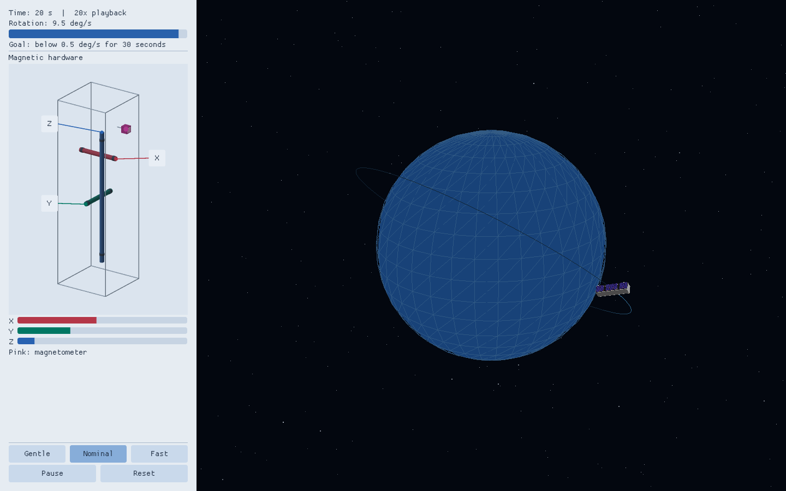

# Detumble

A 3U CubeSat simulator focused on slowing an uncontrolled tumble with **one three-axis magnetometer and three magnetorquers**.

The mission is to stay at or below **0.5 deg/s for 30 seconds**, then continue magnetic damping. Success means low rotation; acquiring an Earth-facing attitude is outside this mission.



## What it simulates

- Three-dimensional rigid-body rotation with quaternion attitude and fixed-step RK4
- A prescribed 500 km circular orbit inclined 51.6 degrees
- Earth's internal magnetic field using IGRF-14, with Earth rotation and a dated scenario
- Magnetometer bias, noise, quantization, saturation, and 10 Hz sampling
- Three body-axis magnetic dipoles, limited to ±0.2 A m² each, switched off during measurements
- Filtered **B-dot** control: oppose changes in the measured magnetic field to damp tumbling

An optional magnetometer-only extended Kalman filter estimates attitude, rotation rate, and sensor bias. It runs alongside the default B-dot controller. The experimental estimated-rate controller takes over only after sustained confidence and falls back to B-dot when confidence is lost. Flight software uses measurements and a field reference from known orbit/time, without access to true attitude or rate.

## Build and run

Requires a C++20 compiler, CMake 3.25+, Ninja, and internet access for the first dependency download. Use the release preset for responsive playback. FreeCAD and Blender are not needed to build or run the bundled models.

On Linux, install the desktop graphics prerequisites first:

```bash
sudo apt-get install libasound2-dev libgl1-mesa-dev libx11-dev \
  libxcursor-dev libxi-dev libxinerama-dev libxrandr-dev
```

```bash
cmake --preset release
cmake --build --preset release
ctest --preset release
./build/release/detumble_viewer
```

The `debug` preset is also available. On Windows, executables have the `.exe` suffix.

## Using the viewer

Choose **Gentle**, **Nominal**, or **Fast** for initial rotation rates of 5, 10, or 15 deg/s. Use **Pause/Play** and **Reset** to inspect or repeat a scenario. Playback is fixed at 20×; it does not change the physical timestep.

The sidebar shows rotation, mission progress, and the configured magnetic hardware layout. X/Y/Z bars and matching rod colors show **recent average applied magnetic strength**, not instantaneous on/off state or electrical power. Hover for component coordinates and dimensions. The pink component is the magnetometer.

The orbital spacecraft uses NASA's ICECube exterior model. The sidebar is a project-authored schematic of a generic 3U layout, not ICECube's actual interior. Visual meshes do not determine mass or inertia. Right-drag orbits the camera; scrolling zooms.

## How Earth's magnetic field works

At each physical step, the simulator calculates the satellite's position, rotates it into Earth-fixed coordinates, evaluates IGRF-14, and rotates the resulting field vector into the satellite's frame. The magnetometer samples that vector with its configured errors. Rod dipoles interact with the true field through `torque = dipole × field`.

IGRF-14 is a published model of Earth's internal main field. Its coefficient table is bundled and compiled into the application; no live data service is needed. The blue globe represents Earth, and its wire grid is a rendering aid. The simulator does not model the full magnetosphere, solar wind, or geomagnetic storms.

Read [the magnetic-field walkthrough](docs/MAGNETIC_FIELD.md) for the calculation steps, dates, and limitations.

## Headless experiments

The viewer, CLI, and campaign runner share the same mission simulation:

```bash
./build/release/detumble --duration 12000 --seed 42 \
  --controller bdot --output runs/bdot.csv
./build/release/detumble --duration 12000 --seed 42 \
  --controller estimated-rate --output runs/estimated-rate.csv
```

Use `--help` for all options. Try `--field-model dipole` for a simpler field, `--sensor-profile ideal` to remove sensor errors, or `--estimator off` to run B-dot without estimation. Using `--reference-field-model dipole` with default IGRF truth introduces a reference-model mismatch. Without an estimator, true-rate scoring still works, but flight software cannot confirm its estimated `LOW_RATE` state.

## Validation and limits

Tests cover dynamics, coordinate frames, independent official IGRF reference values, sensor/actuator scheduling, estimator ambiguity and rejection, deterministic replay, and mission scoring.

Recorded campaigns include a 25-case B-dot baseline and 100 paired holdout cases; both controllers passed all holdout missions. Passing requires the low-rate dwell plus a final 300-second window entirely at or below 0.7 deg/s. These results validate the recorded simulation conditions, not flight hardware or every possible operating condition. [Results and reproduction commands](docs/validation/README.md).

The orbit and navigation reference are prescribed. Disturbance torques, external magnetic fields, residual spacecraft dipole, coil electronics, and power/thermal systems are not modeled. Magnetic-only attitude estimation can remain ambiguous. The optional controller is an experiment and does not consistently detumble faster than B-dot.

## Documentation

- [Magnetic-field guide](docs/MAGNETIC_FIELD.md): plain-language explanation of the environment
- [Technical reference](docs/REFERENCE.md): equations, conventions, defaults, architecture, and limitations
- [Validation](docs/validation/README.md): recorded evidence and reproducible experiments
- [Implementation milestones](docs/PLAN.md): completed project scope
- [Model sources](assets/models/README.md) and [third-party attribution](THIRD_PARTY.md): geometry, data, dependencies, and usage terms

## License

Project-authored code is licensed under [MIT](LICENSE). Third-party software and assets retain their respective terms; see [THIRD_PARTY.md](THIRD_PARTY.md).
