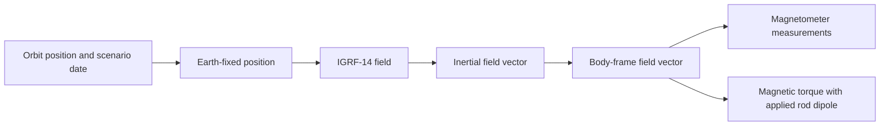

# How Detumble models Earth's magnetic field

Detumble calculates the magnetic-field vector at the satellite's location. It uses that vector to generate magnetometer measurements and the torque produced by the rods. It does not simulate an entire magnetic volume or a plasma environment.

The blue globe in the viewer represents Earth. Its wire grid shows the rendered sphere's geometry, not magnetic field lines. The orbit and spacecraft are scaled for visibility, so screen distances do not determine the physical magnetic field.

## The calculation

With the default 0.02-second physical timestep, the calculation follows this sequence:

1. **Find the satellite's position.** The prescribed circular orbit is 500 km above a spherical Earth and inclined 51.6 degrees. The orbit determines where the spacecraft is; its tumble determines its orientation.
2. **Account for Earth's rotation.** Convert the position from Earth-centered inertial coordinates into Earth-fixed coordinates. This gives the location relative to magnetic features that rotate with Earth.
3. **Evaluate IGRF-14.** Geocentric radius, latitude, longitude, and the scenario date determine the field's strength and direction. The result is a three-component vector, not a single field-strength number.
4. **Rotate the vector back into inertial coordinates.** This is the field at the satellite's location expressed in a space-fixed frame.
5. **Express it in the satellite's body frame.** The simulated attitude determines how the same vector appears along the satellite's X/Y/Z axes.
6. **Measure and actuate.** The magnetometer samples the body-frame field at 10 Hz with configured errors. The simulator computes the true torque from the applied rod dipole and true field: `torque = dipole × field`.

The sensor adds seeded bias and noise, rounds to its quantization step, and applies its saturation limit. At the default timestep, all rods are off for one 20 ms step every 100 ms measurement interval. This is ideal measurement blanking; electrical current rise/decay and magnetic interference are not simulated.

The estimator gets a separate inertial field reference from assumed-known orbit and time. It does not get the true attitude used to generate the simulated measurement. Truth and reference use matching field models by default, but the CLI can deliberately make them differ.

## What IGRF-14 contains

The International Geomagnetic Reference Field is an IAGA model of Earth's internal main field, based on measured geomagnetic data. NOAA publishes the coefficients and reference software. [Official IGRF information](https://www.ncei.noaa.gov/products/international-geomagnetic-reference-field).

Think of it as adding spatial patterns: a dipole gives the broad shape, and additional spherical-harmonic terms describe finer variations. Detumble includes terms through degree 13. It advances the 2025 coefficients using their published annual changes, known as secular variation.

The coefficient table is bundled in `assets/geomagnetic/igrf14coeffs.txt`. A checksum-verified generator turns it into a C++ table, so field evaluation works offline and does not depend on a remote service. [Data provenance and regeneration](../assets/geomagnetic/README.md).

The default scenario starts at **2025-01-01T00:00:00Z**, regardless of today's date. Supported evaluations span 2025 through the start of 2030. Simulation time advances the scenario date. Using a fixed epoch makes seeded runs reproducible.

## Why the field changes

Two effects change what the magnetometer sees:

- **Orbit and Earth rotation:** the spacecraft moves through a field whose strength and direction vary with position.
- **Spacecraft rotation:** even with an unchanged inertial field, tumbling changes its components in the rotating body frame.

B-dot control uses the measured rate of field change to command magnetic damping. Because the orbital field also varies, field change is not a perfect direct measurement of tumble rate.

A magnetic rod creates a dipole along its axis. The cross product with Earth's field produces torque perpendicular to that field. Instantaneously, magnetorquers cannot produce torque along the field; the changing orbital field helps provide control authority in different directions over time.

## What is outside the model

The full magnetosphere includes interactions with the solar wind and external current systems. Those effects, geomagnetic storms, and local spacecraft magnetic contamination are outside this simulator. IGRF here supplies the internal main field.

Earth-fixed and inertial frames are aligned at simulation time zero by convention. We include Earth's spin but do not calculate Greenwich sidereal orientation, precession, or leap seconds. The orbit uses spherical/geocentric coordinates.

The optional `--field-model dipole` uses a simpler centered magnet tilted 11 degrees from Earth's spin axis, with strength decreasing as inverse radius cubed. It is useful for comparisons. `--reference-field-model dipole` with IGRF truth tests how an imperfect navigation field affects estimation and controller fallback.

## Implementation and checks

- [`src/orbit.cpp`](../src/orbit.cpp): orbital position and velocity
- [`src/magnetic_field.cpp`](../src/magnetic_field.cpp): dated IGRF synthesis and Earth rotation
- [`src/environment.cpp`](../src/environment.cpp): true body-frame field and independent navigation reference
- [`src/magnetic_control.cpp`](../src/magnetic_control.cpp): measurement blanking and applied magnetic torque
- [`tests/magnetic_field_test.cpp`](../tests/magnetic_field_test.cpp): independent reference comparisons and frame checks

Six fixtures compare synthesized north/east/down components against the official Fortran implementation within 0.02 nT, including both poles. This checks our numerical implementation against that reference; it is not a claim of 0.02 nT accuracy relative to the real field.

See the [technical reference](REFERENCE.md) for equations, conventions, and sensor parameters, and [validation results](validation/README.md) for the tested mission envelope.
